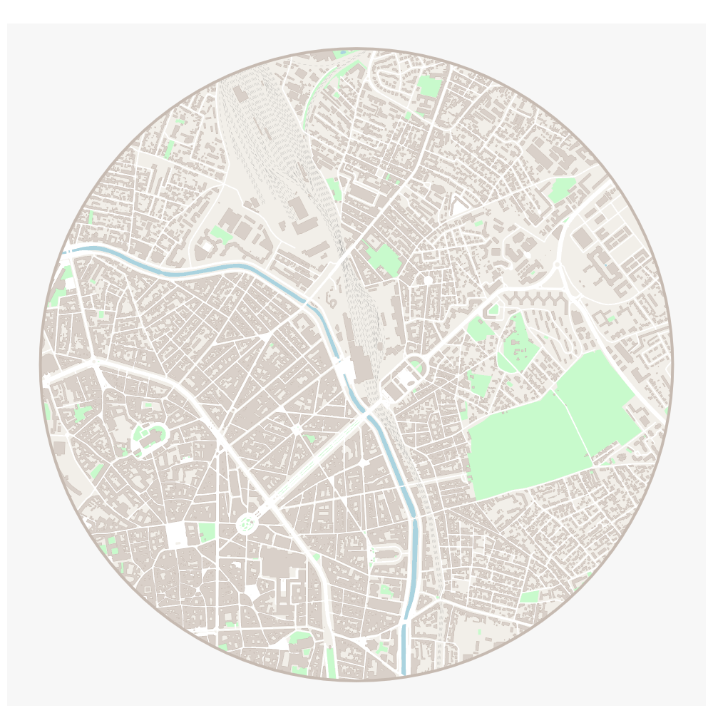

<!-- README.md is generated from README.Rmd. Please edit that file -->

# maposm

## Example

This is a basic example which shows you how to solve a common problem:

``` r
library(maposm)
## basic example code
bb1 <- osmdata::getbb("Gare Matabiau, 31000 TOULOUSE, France")
lon <- mean(bb1[1, ])
lat <- mean(bb1[2, ])
res <- get_city(c(lon, lat), r = 750)
#> Getting buildings: 4.863 sec elapsed
#> Getting green areas: 2.968 sec elapsed
#> Getting water bodies: 3.214 sec elapsed
#> Getting roads: 1.148 sec elapsed
#> Getting streets: 2.273 sec elapsed
#> Getting railways: 1.159 sec elapsed
```

``` r
library(mapsf)
mf_export(res$circle, width = 1000, height = 1000, filename = "man/figures/README-toulouse.png")
mf_map(res$circle, col = "#f2efe9", border = NA, add = TRUE)
mf_map(res$green, col = "#c8facc", border = "#c8facc", lwd = .5, add = TRUE)
mf_map(res$water, col = "#aad3df", border = "#aad3df", lwd = .5, add = TRUE)
mf_map(res$railway, col = "grey50", lty = 2, lwd = .2, add = TRUE)
mf_map(res$road, col = "white", border = "white", lwd = .5, add = TRUE)
mf_map(res$street, col = "white", border = "white", lwd = .5, add = TRUE)
mf_map(res$building, col = "#d9d0c9", border = "#c6bab1", lwd = .5, add = TRUE)
mf_map(res$circle, col = NA, border = "#c6bab1", lwd = 4, add = TRUE)
dev.off()
```


