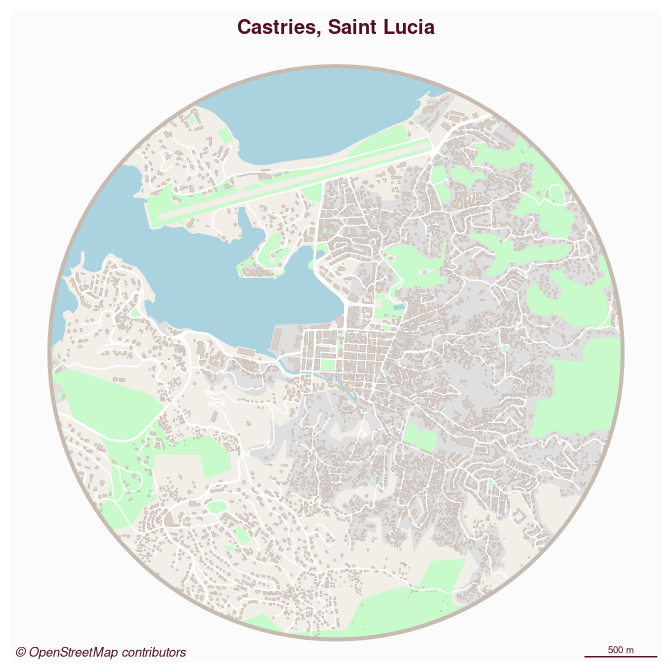
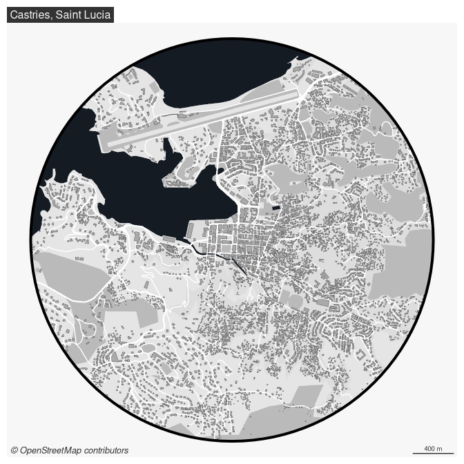
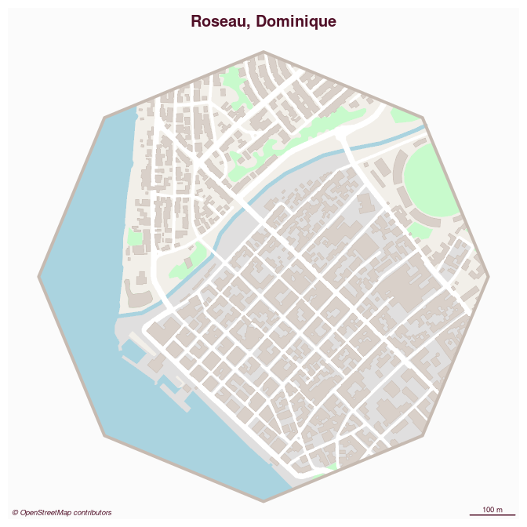

# maposm

## Install

``` r
install.packages("maposm", repos = "https://riatelab.r-universe.dev")
```

## Example

This is a basic example which shows you how to solve a common problem:

``` r
library(sf)
#> Linking to GEOS 3.13.0, GDAL 3.10.2, PROJ 9.5.1; sf_use_s2() is TRUE
library(maposm)
#> Data © OpenStreetMap contributors, ODbL 1.0. https://www.openstreetmap.org/copyright.
#> Maps based on OpenStreetMap data should cite "© OpenStreetMap contributors" as the data source.
library(mapsf)

castries <- get_city(x = c(-60.990260, 14.009623), r = 2000)
#> Getting buildings: 8.174 sec elapsed
#> Getting green areas: 0.549 sec elapsed
#> Getting roads: 0.313 sec elapsed
#> Getting streets: 1.138 sec elapsed
#> Getting railways: 0.362 sec elapsed
#> Getting water bodies: 1.15 sec elapsed
mf_map(castries$zone, col = "#f2efe9", border = NA, add = FALSE)
mf_map(castries$urban, col = "#e0dfdf", border = "#e0dfdf", lwd = .5, add = TRUE)
mf_map(castries$green, col = "#c8facc", border = "#c8facc", lwd = .5, add = TRUE)
mf_map(castries$water, col = "#aad3df", border = "#aad3df", lwd = .5, add = TRUE)
mf_map(castries$railway, col = "grey50", lty = 2, lwd = .2, add = TRUE)
mf_map(castries$road, col = "white", border = "white", lwd = .5, add = TRUE)
mf_map(castries$street, col = "white", border = "white", lwd = .5, add = TRUE)
mf_map(castries$building, col = "#d9d0c9", border = "#c6bab1", lwd = .5, add = TRUE)
mf_map(castries$zone, col = NA, border = "#c6bab1", lwd = 4, add = TRUE)
mf_credits(txt = "\ua9 OpenStreetMap contributors")
mf_scale(size = 500, scale_units = "m")
mf_title("Castries, Saint Lucia")
```

<!-- -->

``` r
m <- mapsf::mf_get_mtq()[1, ]
ajoupa <- get_city(x = m)
#> Getting buildings: 0.996 sec elapsed
#> Getting green areas: 0.838 sec elapsed
#> Getting roads: 0.343 sec elapsed
#> Getting streets: 0.418 sec elapsed
#> Getting railways: 0.301 sec elapsed
#> Getting water bodies: 0.978 sec elapsed
mf_map(ajoupa$zone, col = "#f2efe9", border = NA, add = FALSE)
mf_map(ajoupa$urban, col = "#e0dfdf", border = "#e0dfdf", lwd = .5, add = TRUE)
mf_map(ajoupa$green, col = "#c8facc", border = "#c8facc", lwd = .5, add = TRUE)
mf_map(ajoupa$water, col = "#aad3df", border = "#aad3df", lwd = .5, add = TRUE)
mf_map(ajoupa$railway, col = "grey50", lty = 2, lwd = .2, add = TRUE)
mf_map(ajoupa$road, col = "white", border = "white", lwd = .5, add = TRUE)
mf_map(ajoupa$street, col = "white", border = "white", lwd = .5, add = TRUE)
mf_map(ajoupa$building, col = "#d9d0c9", border = "#c6bab1", lwd = .5, add = TRUE)
mf_map(ajoupa$zone, col = NA, border = "#c6bab1", lwd = 4, add = TRUE)
mf_credits(txt = "\ua9 OpenStreetMap contributors")
mf_scale(size = 500, scale_units = "m")
mf_title("L'Ajoupa-Bouillon, Martinique")
```

<!-- -->

``` r
roseau <- st_as_sf(data.frame(lat = 15.300, lon = -61.388), 
                   coords = c("lon", "lat"), 
                   crs = "EPSG:4326") |>
  st_transform("EPSG:3857") |>
  st_buffer(dist = 500, nQuadSegs = 2) |> 
  get_city()
#> Getting buildings: 1.295 sec elapsed
#> Getting green areas: 0.566 sec elapsed
#> Getting roads: 0.399 sec elapsed
#> Getting streets: 0.516 sec elapsed
#> Getting railways: 0.386 sec elapsed
#> Getting water bodies: 1.198 sec elapsed
mf_map(roseau$zone, col = "#f2efe9", border = NA, add = FALSE)
mf_map(roseau$urban, col = "#e0dfdf", border = "#e0dfdf", lwd = .5, add = TRUE)
mf_map(roseau$green, col = "#c8facc", border = "#c8facc", lwd = .5, add = TRUE)
mf_map(roseau$water, col = "#aad3df", border = "#aad3df", lwd = .5, add = TRUE)
mf_map(roseau$railway, col = "grey50", lty = 2, lwd = .2, add = TRUE)
mf_map(roseau$road, col = "white", border = "white", lwd = .5, add = TRUE)
mf_map(roseau$street, col = "white", border = "white", lwd = .5, add = TRUE)
mf_map(roseau$building, col = "#d9d0c9", border = "#c6bab1", lwd = .5, add = TRUE)
mf_map(roseau$zone, col = NA, border = "#c6bab1", lwd = 4, add = TRUE)
mf_credits(txt = "\ua9 OpenStreetMap contributors")
mf_scale(size = 100, scale_units = "m")
mf_title("Roseau, Dominique")
```

<!-- -->
