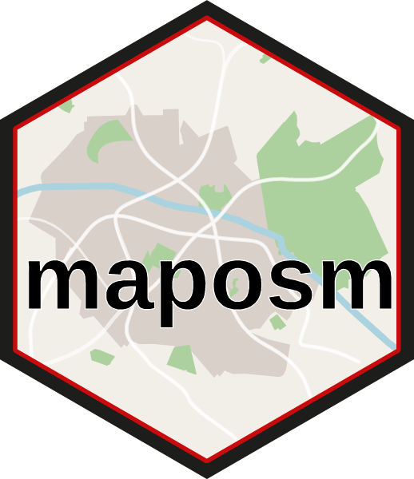

# maposm 

`maposm` is an R package whose main purpose is to download and assemble
multiple geographic layers from the OpenStreetMap database for mapping
purposes.

OpenStreetMap data is downloaded using the
[`osmdata`](https://docs.ropensci.org/osmdata/) package, which in turn
uses the [Overpass
API](https://wiki.openstreetmap.org/wiki/Overpass_API).

The downloaded data is then merged and simplified.

The layers created are:  

- Urban areas 
- Buildings 
- Green spaces 
- Main roads 
- Secondary roads 
- Railroads 
- Water bodies

## Installation

You can install `maposm` from the r-universe.

``` r
install.packages("maposm", repos = "https://riatelab.r-universe.dev")
```

## Demo

`om_get()` is used to download, merge and simplify the geographic
layers.  
`om_map()` can be used to map the layers.

``` r
library(maposm)
#> Data © OpenStreetMap contributors, ODbL 1.0. https://www.openstreetmap.org/copyright.
#> Maps based on OpenStreetMap data should cite "© OpenStreetMap contributors" as the data source.
castries = om_get(x = c(-60.9903, 14.0096), r = 2000)
#> Getting urban areas: 0.696 sec elapsed
#> Getting buildings: 8.124 sec elapsed
#> Getting green areas: 1.591 sec elapsed
#> Getting roads: 0.335 sec elapsed
#> Getting streets: 1.147 sec elapsed
#> Getting railways: 0.253 sec elapsed
#> Getting water bodies: 10.601 sec elapsed
om_map(x = castries, title = "Castries, Saint Lucia", theme = "light")
```

<!-- -->

Several themes are available to map the layers (“light”, “dark” and
“grey”).

``` r
m = mapsf::mf_get_mtq()[33, ]
lmv = om_get(x = m, quiet = TRUE)
om_map(x = lmv, title = "Le Morne-Vert, Martinique", theme = "grey")
```

<!-- -->

You can also use your prefered library to map the layers.

``` r
library(mapsf)
roseau = st_as_sf(data.frame(lat = 15.300, lon = -61.388), 
                   coords = c("lon", "lat"), 
                   crs = "EPSG:4326") |>
  st_transform("EPSG:3857") |>
  st_buffer(dist = 500, nQuadSegs = 2) |> 
  om_get(quiet = TRUE)

mf_map(roseau$zone, col = "#f2efe9", border = NA, add = FALSE)
mf_map(roseau$urban, col = "#e0dfdf", border = "#e0dfdf", lwd = .5, add = TRUE)
mf_map(roseau$green, col = "#c8facc", border = "#c8facc", lwd = .5, add = TRUE)
mf_map(roseau$water, col = "#aad3df", border = "#aad3df", lwd = .5, add = TRUE)
mf_map(roseau$railway, col = "grey50", lty = 2, lwd = .2, add = TRUE)
mf_map(roseau$road, col = "white", border = "white", lwd = .5, add = TRUE)
mf_map(roseau$street, col = "white", border = "white", lwd = .5, add = TRUE)
mf_map(roseau$building, col = "#d9d0c9", border = "#c6bab1", lwd = .5, add = TRUE)
mf_map(roseau$zone, col = NA, border = "#c6bab1", lwd = 4, add = TRUE)
mf_credits(txt = "\ua9 OpenStreetMap contributors")
mf_scale(size = 100, scale_units = "m")
mf_title("Roseau, Dominique")
```

<!-- -->

`om_write()` can be used to write the layers to a geopackage file.  
`om_read()` can be used to read the geopackages.

``` r
# save
om_write(x = roseau, filename = "roseau.gpkg")
# import
om_read(x = "roseau.gpkg")
```
